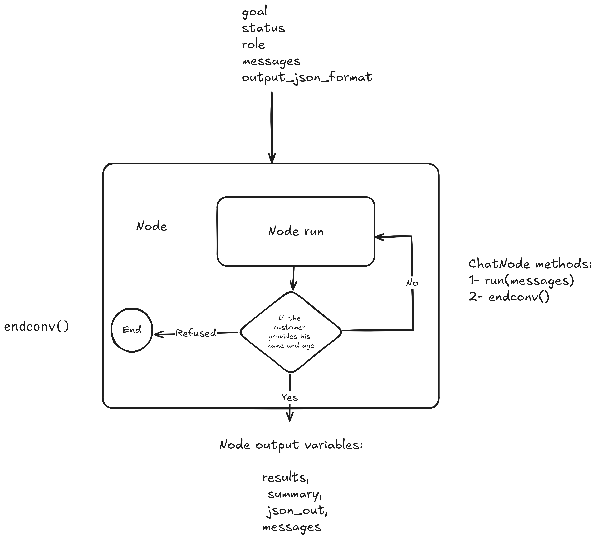

# ChatNode

## Installation

Follow these instructions to install ChatNode and its prerequisites. The code is developed on Ubuntu version 20.04. The required packages are: `re`, `speech_recognition` as `sr`, `pyttsx3`, `json`, and `openai`.

## Explanation of ChatNode

as shown in figure1 :

 

ChatNode is a system designed to facilitate interactions between a client and a chatbot. It operates by processing inputs and generating outputs based on predefined roles and message histories. The ChatNode object requires five inputs:

- **status**: Represents the possible status of the node output and is usually set as `status = """{ "status": "true" or "false" or "nan"}"""`;

- **role**: Defines the role that the chatbot node will assume during interactions;

- **message**: A dictionary used in the ChatGPT API prompt, containing the history of messages exchanged between the client and the chatbot. This dictionary has a specific format:
  1. `{"role": "system", "content": "Enter the role text"}`: Sets the behavior or context for the assistant.
  2. `{"role": "user", "content": "The client request"}`: Represents the user's input or query.
  3. `{"role": "assistant", "content": "The ChatGPT response to the user request"}`: Contains the assistant's response to the user's input.

- **output_json_format**: Specifies the format of the data extracted by the node, for example, `output_json_format = """{ "name": " ", "age": " " }"""`.

To initialize a ChatNode object, use the following code: 
`N1 = ChatNode(goal, status, role, messages, output_json_format)`. 

To evaluate the ChatNode, use the method: 
`results, summary, json_out, messages = N1.run(messages)`. 
To end the conversation duo to lack of information or be the cliant request , use the method: 
N1.endconv() .

The node outputs the following variables:

- **results**: The current status of the ChatNode;

- **summary**: A summary of the findings from the ChatNode;

- **json_out**: The extracted data formatted according to `output_json_format`;

- **messages**: The resulting conversation messages between the client and the ChatNode. This variable is useful for feeding into subsequent ChatNodes in a conversation.

### ChatNode Methods

The ChatNode object includes two main methods:
1. `run(messages)`: Executes the ChatNode with the provided messages.

## Demo

The demo showcases a hot drink shop example, where the client interacts with the chatbot to place an order.

 
